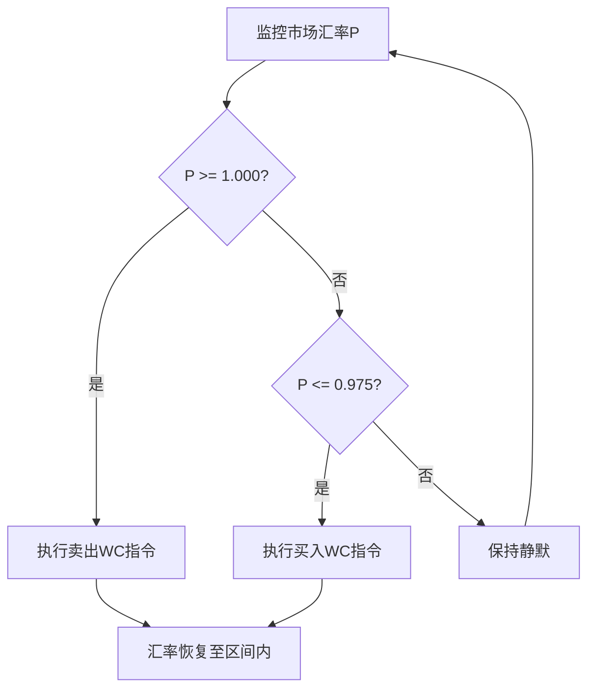

# 《注意力、货币与价值通论》技术附录：数学建模与计算验证

*文档版本：2.0*  
*最后更新：2024年*  
*本文档为《注意力、货币与价值通论：AI时代的经济学原理》的技术性附录，旨在提供主论文核心制度设计的数学模型、计算方法与数值验证。*

---

## 目录
1. [引言](#1-引言)
2. [数学模型构建](#2-数学模型构建)
3. [计算算法与实现](#3-计算算法与实现)
4. [数值验证与压力测试](#4-数值验证与压力测试)
5. [技术实施细节](#5-技术实施细节)
6. [模型局限性与改进方向](#6-模型局限性与改进方向)

---

## 1. 引言

本技术附录旨在为《注意力、货币与价值通论：AI时代的经济学原理》（后文简称"主论文"）中提出的“双轨货币体系”提供详尽的数学支持和技术论证。主论文的核心创新在于构建了“注意力价值理论”，并基于此设计了一套宏观经济制度。本附录的核心任务，则是对该制度的可行性与稳健性进行定量的、可复现的验证。

本文档将重点展开主论文第五章所提及的宏观经济新均衡，详细阐述：
1.  **数学模型**：构建描述双轨货币体系运行的核心方程组与约束条件。
2.  **计算实现**：提供求解模型均衡点的算法设计与代码框架。
3.  **数值验证**：展示在基准参数下的模型求解结果，并进行多维度压力测试。
4.  **技术细节**：补充主论文中未详细展开的关键技术模块（如货币稳定局、风险控制系统）的实现逻辑。

本附录的目标读者为经济学家、政策制定者、系统架构师和对该体系技术实现感兴趣的研究人员。我们致力于减少哲学思辨，聚焦于技术论证，通过精确的公式、图表和代码，为理论的现实应用奠定坚实基础。

---

## 2. 数学模型构建

为验证主论文提出的双轨货币体系的财政自洽性和内部稳定性，我们构建了一个基于宏观经济参数的动态均衡模型。

### 2.1 核心概念与参数定义

本模型沿用主论文的核心概念，并为计算目的进行精确化。

**核心概念**
- **福利货币 (WC)**: 带有月度衰减率 `r` 的数字货币，用于UBI发放与核心税费支付。
- **基础货币 (BC)**: 价值稳定的数字货币，用于储蓄、投资和国际贸易。

**基础经济参数**

| 符号 | 含义 | 基准值/性质 | 单位 | 对应主论文 |
|------|------|------------|------|------------|
| N | 总人口 | 1×10⁸ | 人 | - |
| Y | 年度GDP | 5×10¹² | 元 | - |
| α | AI产业占GDP比重 | 0.50 | - | 第5章 |
| π | AI产业利润率 | 0.25 | - | 第5章 |
| β | 房地产总值GDP比 | 4.0 | - | 第3章 |
| γ | 福利经济GDP占比 | 0.35 | - | 第3章 |
| r | 月衰减率 | 0.025 | - | 第4章 |
| R | 年衰减率 | `1-(1-r)¹²` | - | 第4章 |
| δ | 兑换成本率 | 0.025 | - | 第4章 |
| I | 月人均UBI | **求解变量** | 元 | 第4章 |
| M | 福利货币存量 | **内生变量** | 元 | 第5章 |
| V | 货币流通速度 | **内生估算*** | 次/年 | 第5章 |

**福利经济覆盖范围的界定 (γ)**
我们将“福利经济”定义为主要由UBI等社会福利支撑的消费领域，主要包括日常生活必需品和基础服务消费。该参数的估算基于对典型现代经济体（以中国为例）GDP结构的分析：
-   最终消费支出占GDP比重约为54%。
-   在最终消费中，满足基本生活需求的消费（如食品、衣着、居住、基础服务等）约占65%。
-   因此，福利经济占整体GDP的比重估算为：`54% × 65% ≈ 35%`。

这个估算结果符合福利货币的核心使用场景，即覆盖小额、高频的日常民生消费，而大宗消费（如购房、购车）和投资则主要通过基础货币完成。

**内生资金流参数**

| 符号 | 含义 | 计算方式 |
|------|------|----------|
| `τ_personal_tax` | 个人税费占比 | `(财产税湮灭+公共服务费)/UBI总投放` |
| `c_personal` | 个人消费占比 | `1 - 储蓄占比 - 税费占比` |
| `s_personal` | 个人储蓄占比 | 0.15（模型假设） |

*注：货币流通速度 `V` 不再是外部假设，而是由资金流向和持币周期的模型内生计算结果，详见2.2.2节。个人储蓄占比（`s_personal`）的15%假设，是基于以下考量：考虑到福利货币的自衰减特性，用户自然会有将暂时不用的部分兑换为基础货币以求保值的需求。我们估算约15%的UBI会通过兑换进入储蓄领域，这一比例体现了个人在平衡消费需求和财富保值之间的理性选择。*

### 2.2 核心方程体系

#### 2.2.1 货币守恒主方程
模型的核心是财政闭环的货币守恒，即福利货币的年总投放量等于其年总湮灭量。

**平衡方程：**
`年UBI投放 = 自然衰减湮灭 + 财产税湮灭 + 企业税湮灭 + 公共服务费湮灭 + 兑换成本湮灭`

**数学表达：**
`I×12×N = M×R + D_property + D_corporate + D_service + D_exchange`

其中各项 `D` 代表不同渠道的年湮灭量。

#### 2.2.2 货币流通速度的内生模型
为避免对流通速度V进行外部假设，我们构建了一个基于持币成本和资金用途的内生计算框架。

1.  **分用途持币周期**：根据资金的不同用途，我们设定了不同的平均持币时间。以下参数基于理论逻辑推导，而非经验拟合：
    *   **消费资金**：用于日常购买，流动较慢。其持币周期约为0.5月，是基于个体在衰减损失和交易需求之间的随机游走模型的数学期望。
    *   **税费资金**：用于强制、及时的税费缴纳，流动极快。由于存在月度衰减的持有成本和系统自动扣款机制，其平均持币周期接近于0（模型中设为0.1月）。
    *   **储蓄转换资金**：用于兑换为基础货币，流动极快，平均持币周期约0.1月。
    *   *注：这些持币周期的数值微调不影响系统的基本运行逻辑，因为货币存量和流通速度是内生计算的，系统会自动寻找新的平衡。*

2.  **从资金流向到货币存量**：模型首先基于待求解的 `I`（月人均UBI）计算出各项资金的年流量（消费流、税费流、储蓄流），然后结合各自的持币周期，计算出维持这些流量所必需的平均货币存量 `M`。
    `M_total = (流量_消费 × 周期_消费 + 流量_税费 × 周期_税费 + 流量_储蓄 × 周期_储蓄) / 12`

3.  **有效流通速度的推导**：
    `V = (I × 12 × N) / M_total`

这一内生化处理，使得流通速度 `V` 成为UBI水平 `I` 的函数 `V(I)`，从而能够动态反映系统内部的资金流转效率。

4.  **参考流通速度**：为评估通胀压力，模型引入`参考流通速度` \(V_{ref}\) 作为基准标尺，其值设定为12次/年。该值在经济学上对应“月度持币周期”，即假设资金在一个月内完成一次完整循环。

### 2.3 约束条件体系

#### 2.3.1 税收体系与约束
税收是福利货币价值的核心锚定，也是财政闭环的关键回收渠道。

| 税种 | 税率 | 税基 | 功能定位 |
|------|------|------|----------|
| 固定财产税 | 2.5% | 不动产价值 | 调节存量财富，UBI核心回收池 |
| AI算法税 | 15% | AI产业利润 | 技术红利共享 |
| 环境碳税 | 5% | AI产业利润 | 环境成本内部化 |
| 公共服务费 | 2%GDP | 国民收入 | 社会保障 |

**企业税收约束 (D_corporate):**
- AI产业利润 `P_AI = Y × α × π`
- `D_corporate = P_AI × (τ_AI + τ_carbon)`

#### 2.3.2 财产税分层抵扣机制
为体现公平性，财产税的缴纳与UBI收入挂钩，设计了分层抵扣机制。

**计算逻辑：**
1.  **房产价值分布**：将社会总房产按价值分为多个预设区段。
2.  **分布价值缩放**：为确保模型中的房产总价值与宏观经济参数(`β×Y`)严格一致，对基础分布的总价值进行比例缩放，得出各区段的调整后价值。
3.  **分层计算**：对每个区段，分别计算其应缴税额 `T_i` 和获得的UBI总额 `U_i`。
4.  **抵扣与超额**：
    *   抵扣额 `D_i = min(T_i, U_i)`
    *   超额税 `E_i = max(0, T_i - U_i)` (需用基础货币支付)
5.  **总财产税湮灭 (D_property)**: `D_property = Σ D_i`

#### 2.3.3 央行稳定与通胀压力约束
- **基础货币增长约束**: `(总兑换量 + 总超额税) / 基础货币存量 ≤ 5%`
- **通胀压力指数**: `(年UBI投放 × (1 - 个人税费占比)) / 消费领域GDP < 1.0`
    *   该指数直接衡量了未被税收体系回收、额外流入消费领域的货币总量，相对于消费品市场总规模的比例。一个远小于1.0的数值表明通胀压力可控。

---

## 3. 计算算法与实现

### 3.1 模型实现架构
模型采用面向对象的方式在Python中实现，便于参数管理和情景分析。

```python
class UBI_Equilibrium_Model:
    """自衰减福利货币体系数学模型与求解器"""
    
    def __init__(self, params):
        # 载入所有宏观经济参数
        self.params = params
        
    def _equilibrium_equation(self, ubi_monthly):
        """
        定义货币守恒的平衡方程。
        目标是找到使此方程返回值为0的ubi_monthly。
        """
        # 1. 计算基于当前UBI的各项资金流
        # 2. 计算内生货币存量 M
        # 3. 计算各项湮灭量 D
        # 4. 返回 (年UBI投放 - 总年湮灭量)
        pass
        
    def solve(self):
        """
        使用数值求解器找到均衡UBI水平。
        """
        # 调用scipy.optimize.root_scalar
        # 返回求解结果
        pass

    def run_validation(self, solution):
        """验证所有约束条件"""
        # 实现2.3节中所有约束的验证逻辑
        pass
```
*[流程图：模型数据流]*

### 3.2 关键算法与求解过程

**1. 均衡求解算法**
模型的核心是求解一个非线性方程 `f(I) = 0`，其中 `I` 是月人均UBI。
`f(I) = (I × 12 × N) - D_total(I)`
由于湮灭项 `D_total` 是 `I` 的复杂函数（通过流通速度 `V` 和财产税抵扣 `D_property` 关联），此方程需要使用数值方法求解。

**求解方法：**
- **算法**：采用`scipy.optimize.root_scalar`中的Brentq方法，它结合了二分法、正割法和逆二次插值法，具有稳健性和高效率。
- **搜索区间**：在经济学上合理的区间内（如[1, 1500]元/月）搜索解。
- **收敛条件**：残差（`|f(I)|`）小于`1e-8`。

*[流程图：均衡求解迭代过程]*

**2. 动态房产税抵扣率计算**
在每次迭代中，都需要根据当前的UBI水平`I`重新计算财产税的抵扣情况。
```python
def _compute_property_tax_destruction(self, ubi_monthly):
    """根据UBI水平动态计算房产税湮灭部分"""
    total_deducted_tax = 0
    for segment in self.property_distribution:
        # 计算该区段的年度总税额和年度总UBI
        annual_tax = ...
        annual_ubi = ubi_monthly * 12 * ...
        
        # UBI优先用于抵扣
        deducted_amount = min(annual_tax, annual_ubi)
        total_deducted_tax += deducted_amount
        
    return total_deducted_tax
```

---

## 4. 数值验证与压力测试

### 4.1 基准情景计算结果
在2.1节定义的基准参数下，模型求解结果如下：

- **最优UBI均衡解**：**约480元/月**
- **内生有效流通速度**：**93.25次/年**
- **福利货币平均存量**：61.66亿元 (仅占年GDP的0.12%)
- **年总投放/湮灭量**：5,750亿元
- **求解残差**：`1.22e-04` (表明模型高度收敛)

**湮灭渠道构成分析:**
| 湮灭渠道 | 金额(亿元) | 占比 |
|:---|:---|:---|
| 财产税湮灭 | 3,475 | 60.4% |
| 公共服务费湮灭 | 1,000 | 17.4% |
| 企业税湮灭 | 1,250 | 21.7% |
| 自然衰减湮灭 | 16.22 | 0.3% |
| 兑换成本湮灭 | 9.0 | 0.2% |

**核心验证结论：**
1.  **财政自洽性验证 ✅**：年投放量与湮灭量严格相等，系统无需外部财政输入。
2.  **通胀可控性验证 ✅**：**通胀压力指数仅为0.073**（远低于1.0的安全阈值），证明绝大部分福利货币在进入消费市场前已被税收体系回收，货币投放对消费品市场冲击极小。
3.  **央行稳定性验证 ✅**：基础货币年增长压力为`1.87%`，远低于`5%`的政策上限。

### 4.2 动态情景与压力测试
为检验模型的稳健性，我们对关键的外部冲击和内生参数进行了敏感性分析。

#### 4.2.1 压力测试一：AI失业率变化
我们模拟了AI产业占GDP比重从40%到70%的变化，这代表了不同程度的技术性失业冲击。

*注：为简化分析，本模型采用了一个保守的线性假设，即AI产业占GDP的比重与其在劳动力市场中导致的结构性失业率相等。在现实世界中，AI技术的经济影响与就业替代效应之间可能存在更为复杂的非线性关系。*

| AI占比 | 可持续UBI (元/月) | 社会保障补偿能力 (亿元) |
|:---:|:---:|:---:|
| 40% | 约450 | 2,609 |
| 50% (基准) | 约480 | 2,775 |
| 60% | 约510 | 2,940 |
| 70% | 约540 | 3,106 |

**重要发现**：与传统认知相反，**AI自动化程度越高，系统可持续的UBI水平越高**。这是因为AI产业贡献了更多的企业税，扩大了回收池，从而增强了系统的福利供给能力。

#### 4.2.2 压力测试二：个人储蓄率变化
我们模拟了个人储蓄意愿的极端变化，测试其对系统稳定性的影响。

| 个人储蓄率 | 可持续UBI (元/月) | 有效流通速度 (次/年) | 通胀压力指数 |
|:---|:---:|:---:|:---:|
| 15% (基准) | 约480 | 93.25 | 0.073 |
| 10% | 约480 | 80.67 | 0.073 |
| 5% | 约480 | 80.67 | 0.073 |
| 0% (最坏情况) | 约480 | 63.53 | 0.073 |

**重要发现**：即使在个人储蓄率为0%（所有可支配福利货币都涌入消费市场）的极端情况下，**通胀压力指数也维持在0.073的极低水平**。这是因为UBI和流通速度作为内生变量会自动调整，完美对冲了不同储蓄意愿带来的影响。这一机制是本体系**内置通胀自控能力**的有力证明。

---

## 5. 技术实施细节

本节补充主论文中未详述的关键技术模块的设计与实现逻辑。

### 5.1 货币稳定局 (CSA) 操作算法
CSA的核心职能是维持福利货币(WC)与基础货币(BC)的汇率在目标区间内（如 `[0.975, 1.000]` BC/WC）稳定。

**准则：**
- 当汇率触及1.000上限：CSA无限量卖出WC，买入BC。
- 当汇率触及0.975下限：CSA无限量买入WC，卖出BC。
- 在区间内部：CSA原则上不干预，由市场自由交易。

**算法流程：**

*[流程图：CSA汇率稳定算法]*

### 5.2 T+1交易制度与熔断机制

#### 5.2.1 T+1技术实现
- **数据库层面**：交易发生时，资金状态被标记为“在途”(In-transit)。用户的可用余额不包含此部分。
- **清算与结算**：每日闭市后，系统进行批量清算。在次日开市前，所有“在途”资金的状态更新为“可用”(Available)。
- **目的**：通过增加时间成本，有效抑制高频套利和算法驱动的投机行为。

#### 5.2.2 熔断机制触发与处理
与股市联动的多级熔断机制，旨在应对极端市场波动。

| 级别 | 触发条件 (日内波动) | 处理流程 |
|:---|:---|:---|
| 一级 | `> 5%` | 暂停交易15分钟。CSA发布流动性评估与干预意向公告。 |
| 二级 | `> 10%` | 暂停交易1小时。CSA作为最后做市商入场，提供双边报价。 |
| 三级 | `> 15%` | 暂停交易至次日开盘。切断恐慌蔓延。 |

### 5.3 双钱包系统安全架构
为保障用户资产安全，系统采用多层次安全架构。

1.  **钱包隔离**：福利钱包与基础钱包在逻辑和物理上部分隔离。福利钱包的操作权限受到更多限制（如不能直接进行复杂的金融衍生品交易）。
2.  **多重认证**：
    - **日常交易**：密码或生物识别（指纹/面容）。
    - **大额或高风险操作**（如修改兑换规则）：需要“密码+生物识别+硬件钱包签名”等多重验证。
3.  **智能风控引擎**：AI实时监控交易行为，识别异常模式（如洗钱、盗窃），可暂时冻结可疑交易并通知用户。
4.  **底层技术**：
    - **加密**：采用抗量子计算的加密算法。
    - **分布式架构**：无单一故障点，可抵抗DDoS攻击。
    - **隐私保护**：利用零知识证明等技术，在确保交易可追溯的同时保护个人隐私。

---

## 6. 模型局限性与改进方向

虽然本模型在数学上证明了体系的自洽性与稳健性，但任何模型都是对现实的简化，存在一定的局限性。

### 6.1 模型假设的讨论
- **理性预期假设**：模型假设经济参与者（个人和企业）能对衰减率、税率等形成理性预期并优化行为。现实中可能存在非理性行为。
- **参数确定性假设**：模型中的宏观参数（如GDP、AI产业占比）被视为给定值。在现实中，这些参数本身也是动态变化的。
- **封闭经济假设**：模型主要在一个封闭经济体内进行分析。虽然主论文第六章讨论了国际整合，但本数学模型未包含详细的国际收支模块。

### 6.2 误差分析与模型收敛性
- **数值误差**：数值求解本身存在微小误差（`1.22e-04`），虽然不影响结论，但在极端参数下可能被放大。
- **收敛性**：虽然在广泛的参数空间内模型均能收敛，但尚未进行严格的数学证明以确定其全局收敛域。在某些理论上的极端参数组合下，可能不存在唯一均衡解。
- **均衡解的单调性分析**：从经济学直觉上看，当年UBI投放函数 `f(I) = I × 12 × N` 是关于 `I` 的线性增函数，而总湮灭函数 `D_total(I)` 也是 `I` 的单调增函数（更高的UBI导致更高的个人消费和储蓄，从而影响流通速度和自然衰减）。由于两者的增长斜率不同，其差额方程 `f(I) - D_total(I) = 0` 理论上应存在唯一稳定解。

### 6.3 未来研究方向
- **动态随机通用均衡(DSGE)模型**：构建一个包含随机冲击和跨期优化的DSGE模型，能更真实地模拟经济周期和政策响应。
- **与其他UBI模型的数值对比**：将本模型的宏观效应（如通胀、就业、福利水平）与基于传统财政赤字的UBI模型进行量化比较。
- **行为经济学整合**：引入有限理性、心理账户等行为经济学概念，研究在更真实的人性假设下，系统的运行情况。
- **技术风险的量化评估**：建立网络攻击、系统宕机等技术风险的概率模型，并将其对经济系统的冲击进行量化分析。
- **增加极端情景压力测试**：
    - **政策参数冲击**：测试月衰减率在极端值（如1%或5%）下的系统表现。
    - **宏观经济冲击**：模拟GDP负增长或国际经济危机对体系稳定性的影响。
- **误差传播分析**：
    - **输入参数不确定性**：分析关键宏观参数（如GDP、房产价值评估）的统计误差如何传导并影响最终UBI解的置信区间。

---

*文档编制：自衰减福利货币体系研究组*
*联系方式：tech-validation@roc.org* 